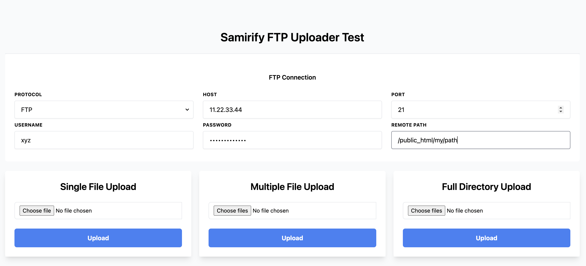

# FTP Uploader - PHP Hexagonal
A simple FTP uploader which is built with PHP Hexagonal architecture.

It's just a prototype which I will keep improving when/if I get a chance 😎

## Disclaimer
Before we start, I'd like to point out that this is not a "package" or an "application" to be used to upload files to an FTP server!
It all started when I wanted to implement my understanding of [Hexagonal Architecture (Ports & Adapters)](https://en.wikipedia.org/wiki/Hexagonal_architecture_(software)) by [Alistair Cockburn](https://en.wikipedia.org/wiki/Alistair_Cockburn) in PHP. 
I then wrote this FTP Uploader as a "Service" example.

### [Documentation](app/README.md)

## Get started
```git clone https://samirify-tech@bitbucket.org/samirify/samirify-dt-lvm.git```

`make install` 

`make worker` >> Run the message broker

## Example

Create a folder in the `app` folder and place some files in it (let's use `app/my-files` in this example).

Now head to Postman, or any API manager, and run this endpoint:

UR: `http://localhost:8091/upload-files`

Method: `POST`

Params:
```
{
    "files_path": "/my-files", // Retalive to the app root (i.e. app/my-files)
    "ftp": {
        "protocol": "ftp", // See app/src/Services/Ftp/Services/Constants.php for supported protocols list.
        "host": "xxxxxxx",
        "port": 21, // If not set the default would be 21
        "username": "xxxxxxx",
        "password": "xxxxxxx",
        "remotePath": "" // Retalive to your host root. If blank the system will use the value of FTP_PATH in .env file if set or default to host root instead
    }
}
```

If you will always use one FTP account you could set it up in `app/.env` file as follows:
```
FTP_PROTOCOL=ftp # See app/src/Services/Ftp/Services/Constants.php for supported protocols list.
FTP_HOST=
FTP_PORT=21 # If not set the default would be 21
FTP_USERNAME=
FTP_PASSWORD=
FTP_PATH=/public_html/my/path # Retalive to your host root. If blank the system will use the value of FTP_PATH in .env file if set or default to host root instead
```
## New UI
I created this page which will make it a lot easier to test [Click here once your Docker containers are up](http://localhost:3067/)



## Result
Check [The mailbox](http://localhost:8092/)